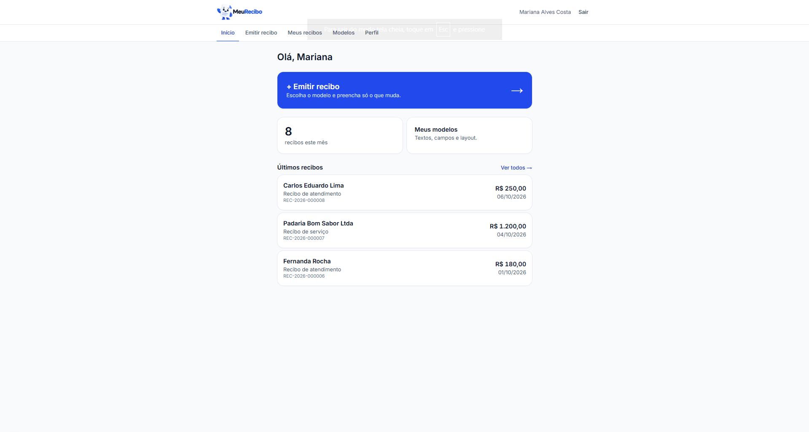
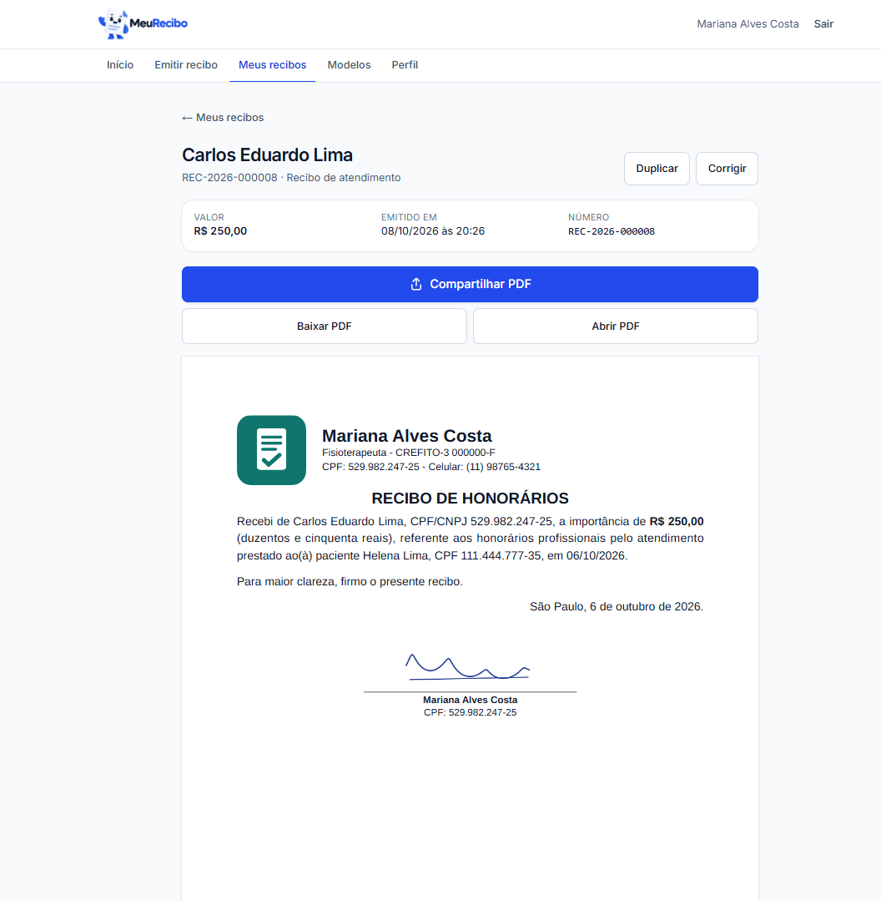
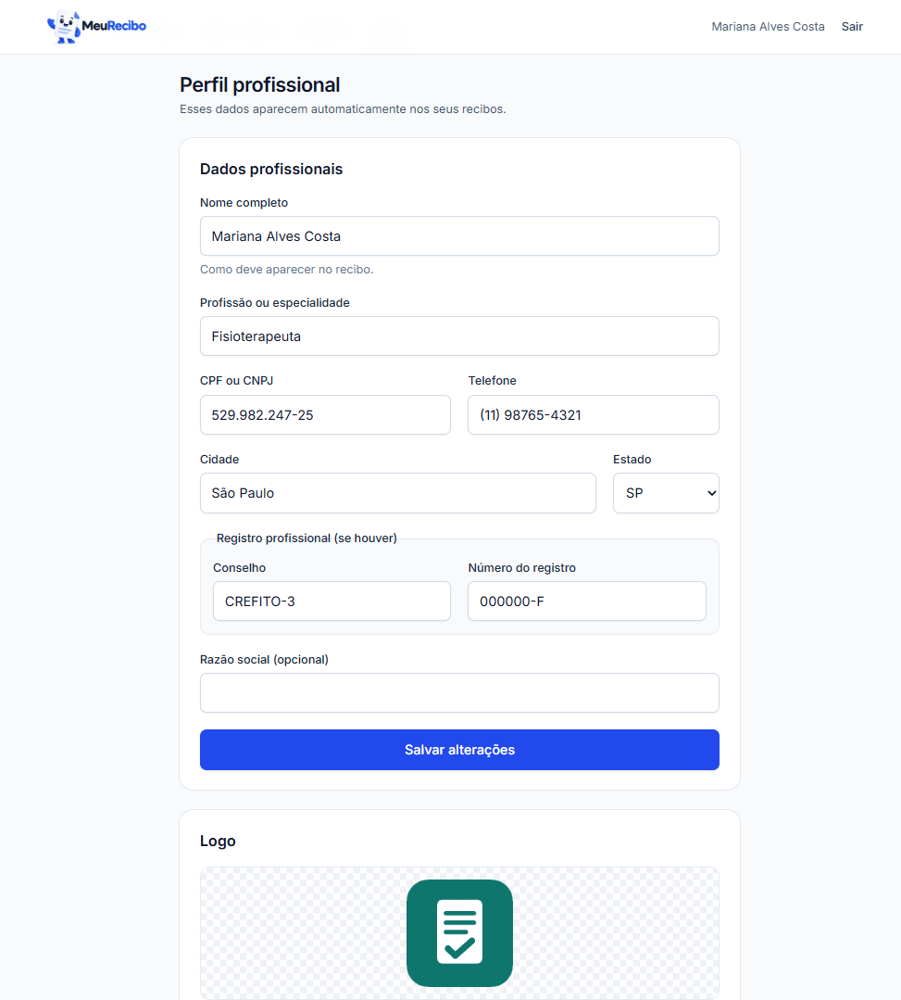
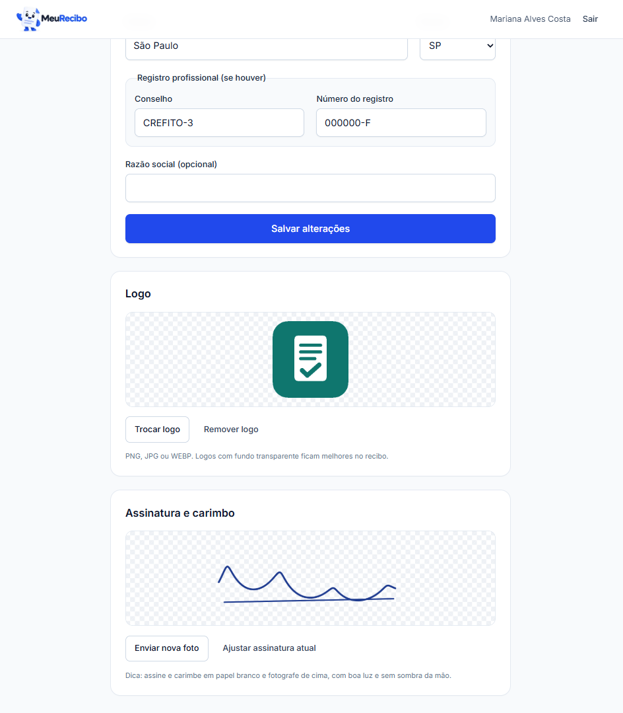
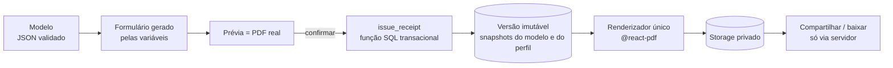
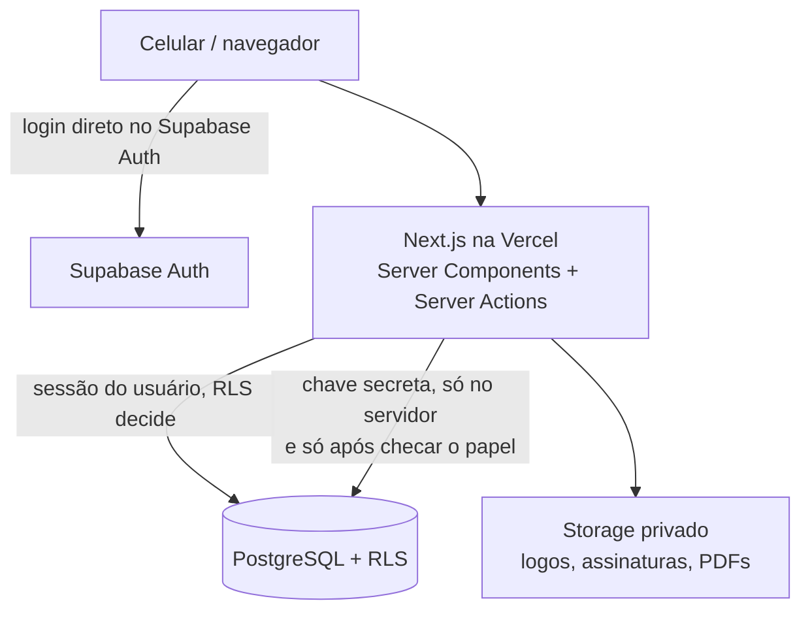

# MeuRecibo

Emissão de recibos profissionais em PDF pelo celular: **configure uma vez, emita em poucos segundos.**



## Contexto

Profissionais autônomos costumam emitir recibos editando um documento pronto: abrem o arquivo, apagam os dados do último cliente, digitam os novos, salvam e enviam. Cada recibo repete o mesmo trabalho manual, não existe histórico organizado, a numeração fica por conta da memória e, no celular, editar um documento desses é desconfortável.

O MeuRecibo transforma esse documento em um **modelo**. O texto, o cabeçalho com os dados profissionais, a logo e a assinatura ficam prontos, e a cada recibo só se preenche o que muda: quem pagou, o valor, a data. O sistema gera o PDF, numera, guarda no histórico e compartilha direto pelo celular.

## O que o sistema faz

- **Editor de modelos estilo Word**, com variáveis em forma de "chip" (`Nome do pagador`, `Valor`, `Data`...), cabeçalho automático com os dados profissionais, logo, até quatro assinantes, fontes e alinhamentos. Salva sozinho, com controle de edição simultânea entre abas.
- **Emissão em segundos.** O formulário é gerado a partir das variáveis do modelo. O valor por extenso, a cidade e a data de emissão são preenchidos automaticamente.
- **Prévia fiel.** A prévia é o próprio PDF, gerado antes de confirmar.
- **Numeração automática** por ano (`REC-2026-000001`), sem números repetidos nem pulados.
- **Correção sem perder o original.** Corrigir gera uma nova versão com o mesmo número, e as anteriores continuam acessíveis.
- **Histórico** com busca por nome, CPF ou número, filtros por período e modelo e o total do período.
- **Compartilhar pelo celular.** O PDF vai direto para o menu de compartilhamento do aparelho (WhatsApp, e-mail...).
- **Logo e assinatura por foto.** Recorte e remoção do fundo da assinatura são feitos no próprio aparelho.
- **Administração.** Contas criadas só pelo administrador, com login por nome de usuário, senha temporária no primeiro acesso, desativação, exclusão de conta conforme a LGPD, modo suporte somente leitura e auditoria.

| | |
|---|---|
|  |  |
| Editor de modelos, com variáveis e assinatura | Recibo emitido: prévia do PDF e compartilhamento |
|  |  |
| Escolha do modelo, com os campos de cada um | Histórico com busca, total e versões |
|  |  |
| Perfil profissional, que preenche o cabeçalho | Logo e assinatura com fundo removido |

## Resultado

Em uso real há cerca de um mês. Emitir um recibo deixou de ser editar um documento e passou a ser **preencher só os dados que mudam**, a partir de modelos prontos, inclusive pelo celular. Todos os recibos ficam num histórico pesquisável, com numeração automática.

## Stack e arquitetura

- **Next.js 16** (App Router, Server Components, Server Actions) + **React 19** + **TypeScript**
- **Tailwind CSS 4**
- **Supabase**: PostgreSQL com Row Level Security em todas as tabelas, Auth e Storage privado
- **TipTap 3** (editor), **@react-pdf/renderer** (PDF vetorial) e **pdf.js** (exibição do PDF em qualquer navegador, inclusive no iOS)
- **Zod** para validar tudo que entra, inclusive o conteúdo do editor
- **Vitest** + **PGlite** (Postgres embutido nos testes de RLS) e **Playwright** + **axe** (testes de ponta a ponta e acessibilidade)
- Deploy na **Vercel**





Decisões e detalhes de cada parte estão em [docs/ARQUITETURA.md](docs/ARQUITETURA.md).

## Decisões técnicas

**1. A prévia é o próprio PDF.** Um único renderizador gera a prévia e o arquivo final, então o que se vê antes de confirmar é exatamente o que será emitido. Cada versão guarda um *snapshot* do modelo e do perfil, de modo que o PDF pode ser regenerado idêntico mesmo depois que o modelo mudar. Para o PDF aparecer igual em qualquer aparelho (o iOS não exibe PDF de várias páginas em `<iframe>`), ele é desenhado com pdf.js.

**2. O modelo é JSON validado, nunca HTML.** O editor salva um documento estruturado, e o servidor o valida com um schema Zod recursivo: só tipos de nó, marcas, fontes, cores e tamanhos de listas fechadas. A renderização mapeia cada nó para um componente, sem `dangerouslySetInnerHTML`. Isso fecha a principal porta de XSS de um editor de texto rico.

**3. Remoção de fundo da assinatura no próprio aparelho.** Assinatura e carimbo são tinta sobre papel, um problema de limiarização e não de inteligência artificial. Um algoritmo próprio de limiarização adaptativa estima a cor do papel região por região (o que corrige a sombra e a iluminação desigual de fotos de celular), mede quanto cada pixel é mais escuro que o papel ao redor, converte isso em transparência com bordas suaves e preserva a cor da tinta. É uma função pura sobre os pixels, testável sem navegador. Nenhuma imagem sai do celular, e o custo é zero. As bibliotecas de IA avaliadas tinham licença AGPL e eram treinadas para recortar pessoas, não tinta.

**4. Numeração transacional.** O número do recibo é alocado dentro da mesma transação que cria o recibo, travando o contador do usuário naquele ano. Não há colisão sob concorrência nem buracos na sequência, e uma chave de idempotência impede que um toque duplo emita dois recibos.

## Como rodar

Pré-requisitos: **Node.js 22+** e **Docker Desktop** (para o Supabase local).

```bash
npm install
npx supabase start          # Supabase local; aplica as migrations automaticamente
cp .env.example .env.local  # preencha com os valores de `npx supabase status`
npm run seed                # dados fictícios: profissional, logo, assinatura, modelos e recibos
npm run dev                 # http://localhost:3000
```

O seed só roda contra um Supabase em `localhost`. Usuários criados (senha `demo123456`):

| Usuário | Papel |
|---|---|
| `demo` | Profissional, com modelos e recibos emitidos |
| `admin` | Super admin |

Para recomeçar do zero: `npx supabase db reset` e `npm run seed`.

### Scripts

| Comando | O que faz |
|---|---|
| `npm run dev` | servidor de desenvolvimento |
| `npm run build` | build de produção |
| `npm run typecheck` / `npm run lint` | verificação de tipos / lint |
| `npm test` | testes unitários + testes de banco (RLS) em Postgres embutido, sem rede |
| `npm run test:integration` | isolamento entre usuários contra um projeto Supabase de desenvolvimento (usa `.env.local`) |
| `npm run test:e2e` | ponta a ponta no navegador (Chrome instalado, tela de celular): emissão, correção, modo suporte, acessibilidade, CSP e limites |
| `npm run seed` | dados fictícios de demonstração (só Supabase local) |
| `npm run db:push` | aplica as migrations num projeto remoto (`SUPABASE_DB_URL`) |
| `npm run admin:create` | cria o Super Admin (bootstrap de um ambiente novo) |

### Segurança

- A **RLS do Postgres** é a camada de segurança; o frontend nunca é. Os testes de banco verificam que um usuário nunca lê, cria, altera ou apaga dados de outro.
- `SUPABASE_SECRET_KEY` e `SUPABASE_DB_URL` são **somente servidor/local**. Nunca use o prefixo `NEXT_PUBLIC_` nelas.
- CSP com *nonce* por requisição, limite de requisições por usuário nas ações sensíveis e rascunhos com dados pessoais guardados só na sessão do navegador.
- Testes, scripts e o seed se recusam a rodar contra o banco de produção.
- Nunca use dados reais em desenvolvimento ou testes.

## Status

Sistema em produção. Os dados do seed e dos prints são fictícios.
